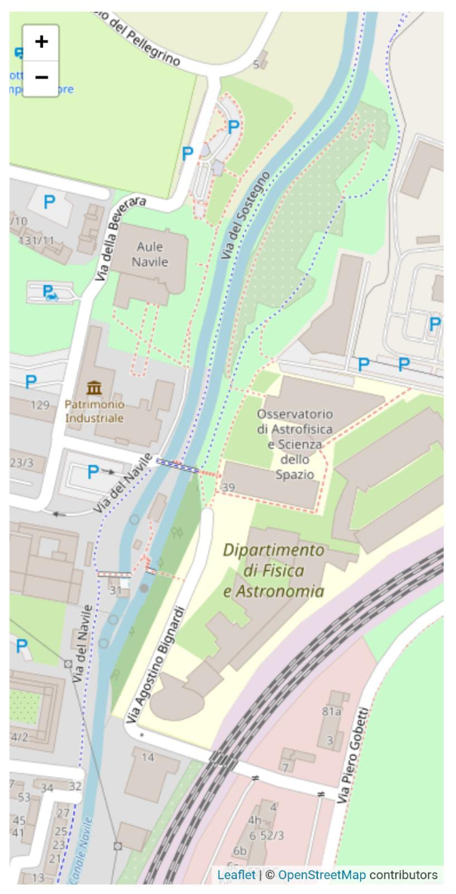
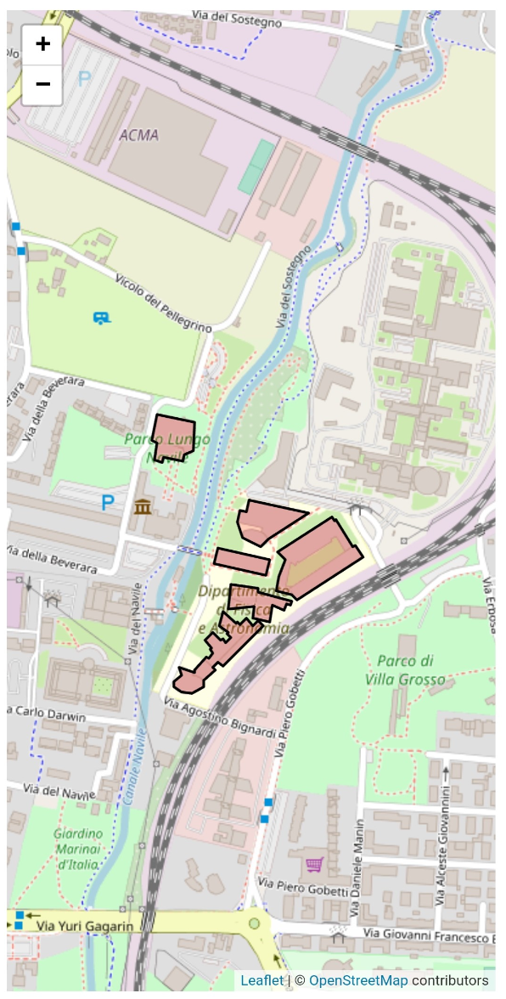
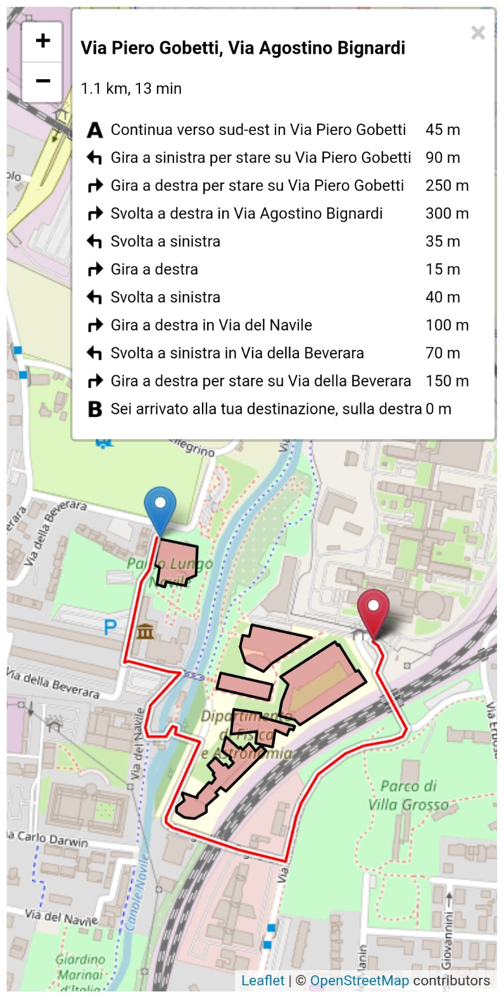
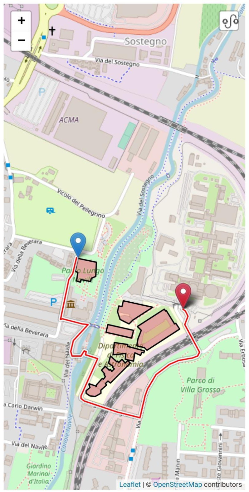
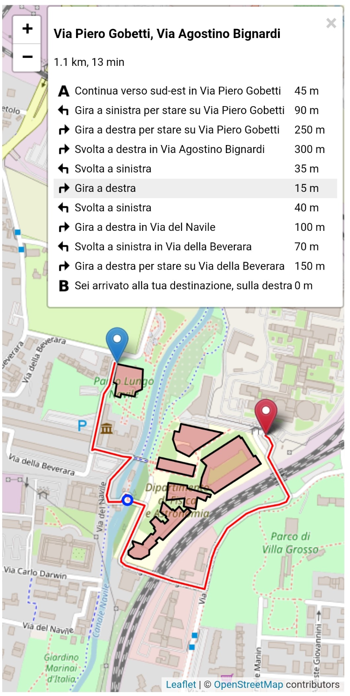
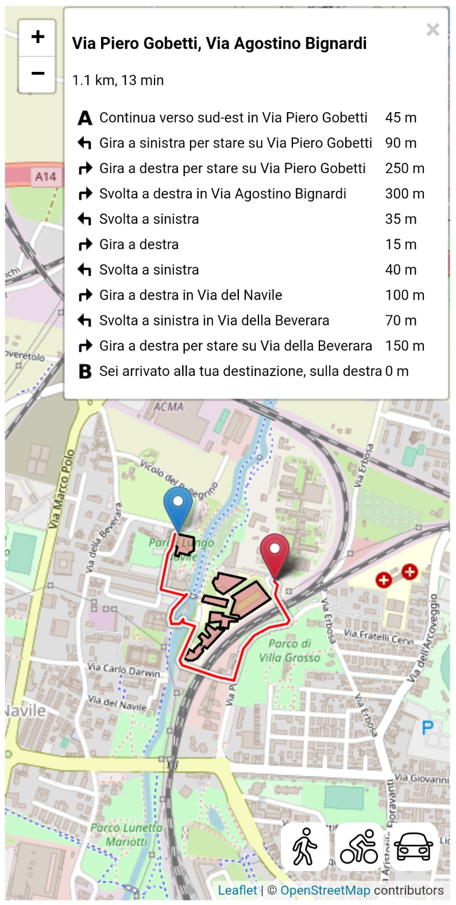
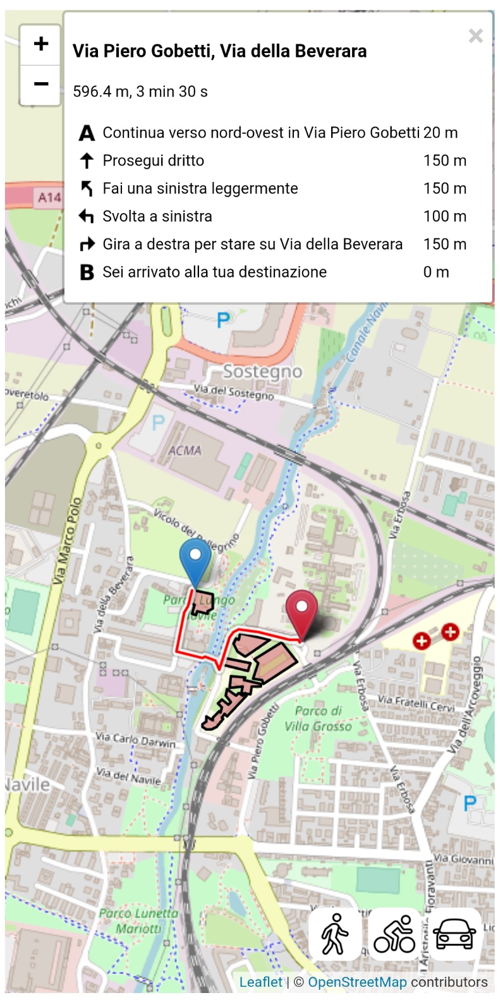
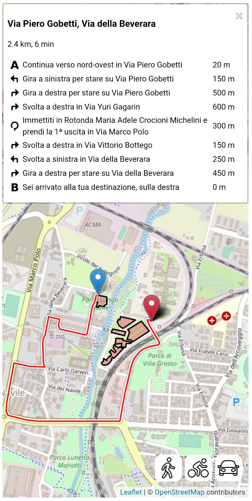

# Campus Navigator - Interactive Map & Route Finder for Bologna

**Internship Project - University of Bologna**

### Developed by: Alessandro Magnani  
**Academic Year**: 2020-2021  
**Tutors**: Prof.ssa Catia Prandi  

## Overview

The main goal of this project was to develop a **native mobile application** to provide an interactive, navigable map for the new Bologna campus, enabling users to view paths and routes to various campus locations. This application is particularly useful for students and visitors who need real-time navigation and easy access to campus information.

The project was implemented using **React Native**, with support from **Expo**, which allowed direct testing on mobile devices. The application leverages **OpenStreetMap** for map data and **MapBox** APIs for routing and navigation.

---

## Features

### 1. **Interactive Campus Map with Building Information**

An interactive map displays the Bologna campus, allowing users to view and click on campus buildings for additional information.




### 2. **User Geolocation**

The app utilizes the `expo-location` API to track the user's current location on campus, which serves as the starting point for routes.

### 3. **Route Calculation and Navigation**

Using MapBox's Directions API, the app calculates routes from the user's current location to selected destinations. The route information includes distance, estimated duration, and step-by-step directions.

- **Routing Steps**: Each step in the route is clickable, displaying the corresponding map location.
- **Compact Route Display**: The route information table can be minimized for convenience on smaller screens.





### 4. **Arrival Marker Customization**

Users can set their destination by tapping on buildings, moving the marker, or dragging it manually across the map.

### 5. **Navigation Profiles**

Three different navigation modes (walking, biking, driving) are available to enhance route calculations. Each mode optimizes routes based on the chosen travel method.





---

## Technology Stack

- **JavaScript**: Main programming language for application logic.
- **React Native**: Framework for cross-platform mobile development.
- **Expo**: Platform for managing mobile deployments and testing on devices.
- **Leaflet.js**: Library for map interactivity and rendering.
- **OpenStreetMap** and **MapBox**: Providers for map data, with MapBox also supporting route calculations.

---

## Installation and Setup

To run the project locally:

1. Clone the repository and navigate to the project folder.
2. Install dependencies:
   ```bash
   npm install
3. Start Expo:
   ```bash
   expo start
4. Scan the QR code with Expo Go on your mobile device to view the application.

---

## Future Development
Possible future features include:
- **Real-time class and event schedules** for each building, providing up-to-date information on campus activities.
- **Classroom-specific details** to aid students and staff in navigating the campus more effectively.

---

## References

- [React Native Documentation](https://reactnative.dev/docs/getting-started)
- [Expo Documentation](https://docs.expo.dev/)
- [MapBox Directions API](https://docs.mapbox.com/api/navigation/directions/)
- [Leaflet.js Documentation](https://leafletjs.com/)
